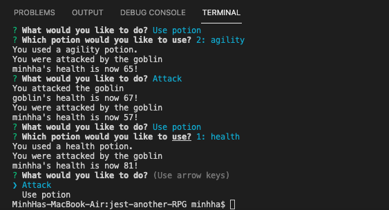

# jest-another-RPG
A Node.js command-line game using OOP structure and Jest testing framework to verify proper object creation and method usage.

## Screenshot

    </img>

## Instructions
Clone the app to your local computer
* Npm init
* Npm install
* Npm install inquirer
* npm install jest --save-de
* node app.js

## GitHub Repo
https://github.com/minhhap/jest-another-RPG